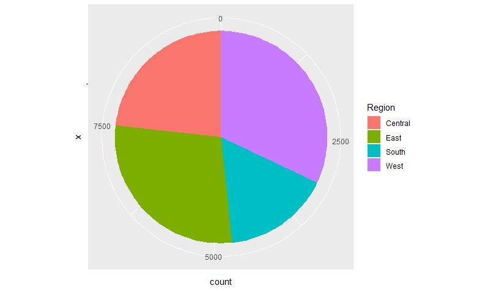
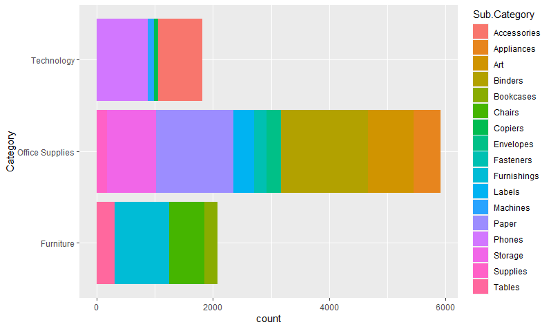

# R-Assignment 4

**Created by Sirapope Chaitiumwong (ID: 63130500117)**

Choose Dataset:

2. Superstore Sales Dataset (Data from Rohit Sahoo,[Kaggle](https://www.kaggle.com/rohitsahoo/sales-forecasting)) >> [Using CSV](https://raw.githubusercontent.com/safesit23/INT214-Statistics/main/datasets/superstore_sales.csv)


### Outlines
1. Explore the dataset
2. Learning function from Tidyverse
3. Transform data with dplyr and finding insight the data
4. Visualization with GGplot2

## Part 1: Explore the dataset

```
#library
library(dplyr)
library(readr)      
library(stringr)    
library(assertive)

#dataset
superstore <- read.csv("https://raw.githubusercontent.com/safesit23/INT214-Statistics/main/datasets/superstore_sales.csv")
View(superstore)
```

In this dataset has 
order id,
order date,
shipment date ,
shipment mode,
customer id,
customer name,
segment,
country,
city,
state,
postal code,
region,
category,
sub category,
product id,
product name,
sales
```
> glimpse(superstore)
Rows: 9,800
Columns: 18
$ Row.ID        <int> 1, 2, 3, 4, 5, 6, 7, 8, 9, 10, 11, 12, 13, 14, 15, 16, 17, 18, 19, 20, 21, 22, 23, 24, 25, 26, 27~
$ Order.ID      <chr> "CA-2017-152156", "CA-2017-152156", "CA-2017-138688", "US-2016-108966", "US-2016-108966", "CA-201~
$ Order.Date    <chr> "08/11/2017", "08/11/2017", "12/06/2017", "11/10/2016", "11/10/2016", "09/06/2015", "09/06/2015",~
$ Ship.Date     <chr> "11/11/2017", "11/11/2017", "16/06/2017", "18/10/2016", "18/10/2016", "14/06/2015", "14/06/2015",~
$ Ship.Mode     <chr> "Second Class", "Second Class", "Second Class", "Standard Class", "Standard Class", "Standard Cla~
$ Customer.ID   <chr> "CG-12520", "CG-12520", "DV-13045", "SO-20335", "SO-20335", "BH-11710", "BH-11710", "BH-11710", "~
$ Customer.Name <chr> "Claire Gute", "Claire Gute", "Darrin Van Huff", "Sean O'Donnell", "Sean O'Donnell", "Brosina Hof~
$ Segment       <chr> "Consumer", "Consumer", "Corporate", "Consumer", "Consumer", "Consumer", "Consumer", "Consumer", ~
$ Country       <chr> "United States", "United States", "United States", "United States", "United States", "United Stat~
$ City          <chr> "Henderson", "Henderson", "Los Angeles", "Fort Lauderdale", "Fort Lauderdale", "Los Angeles", "Lo~
$ State         <chr> "Kentucky", "Kentucky", "California", "Florida", "Florida", "California", "California", "Californ~
$ Postal.Code   <int> 42420, 42420, 90036, 33311, 33311, 90032, 90032, 90032, 90032, 90032, 90032, 90032, 28027, 98103,~
$ Region        <chr> "South", "South", "West", "South", "South", "West", "West", "West", "West", "West", "West", "West~
$ Product.ID    <chr> "FUR-BO-10001798", "FUR-CH-10000454", "OFF-LA-10000240", "FUR-TA-10000577", "OFF-ST-10000760", "F~
$ Category      <chr> "Furniture", "Furniture", "Office Supplies", "Furniture", "Office Supplies", "Furniture", "Office~
$ Sub.Category  <chr> "Bookcases", "Chairs", "Labels", "Tables", "Storage", "Furnishings", "Art", "Phones", "Binders", ~
$ Product.Name  <chr> "Bush Somerset Collection Bookcase", "Hon Deluxe Fabric Upholstered Stacking Chairs, Rounded Back~
$ Sales         <dbl> 261.9600, 731.9400, 14.6200, 957.5775, 22.3680, 48.8600, 7.2800, 907.1520, 18.5040, 114.9000, 170~

```

## Part 2: Learning function from Tidyverse

- Function `select()` from package ```dplyr```. It using for select columns
```
superstore %>% select(Order.ID,State,City)
```
- Function `filter()` from package ```dplyr```. It is used to subset a data frame, retaining all rows that satisfy your conditions.
```
superstore %>% filter(State == "Kentucky")
```
- Function `arrange()` from package ```dplyr```. It using for sort rows
```
superstore %>% select(Order.ID,State,City) %>% arrange(State)
```
- Function `group by()` from package ```dplyr```. group_by() takes an existing tbl and converts it into a grouped tbl
```
superstore %>% group_by(Order.ID)
```
- Function `as_tibble()` from package ```tibble```  as_tibble It is a efficient methods for matrices and data frames.
```
as_tibble(superstore)
```
- Function `str_subset(x, pattern)` from package ```stringr```. It is use to extracts the matching components.
```
fruit <- c("apple", "banana", "pear", "pineapple")
str_subset(x, "[aeiou]")
#> [1] "video"     "cross"     "extra"     "deal"      "authority"
```
- Function `ymd()` from package ```lubridate```. It using for transforms dates stored in character and numeric vectors to date, these functions will parse dates correctly even when the input vectors contain differently formatted dates.
```
dmy("9/5/2002")
#> [1] "2002-05-09"
```
** You can sepearate this part or combine in part of `Transform data with dplyr and finding insight the data`

## Part 3: Transform data with dplyr and finding insight the data

### 1 Find the Maximum sales from Category furniture

```
maxs <- superstore %>% select(Category,Sales) %>% filter(Category == "Furniture")
max(maxs$Sales)
```
Result:
```
> max(maxs$Sales)
[1] 4416.174
```
Explain:
```
- เลือก values ที่ต้องการตามโจทย์
- ตั้ง filter ให้มีเฉพาะ Furniture
- เก็บค่าไว้ใน variable ชื่อว่า maxs

```
### 2 Find the number of order that customer name is "Brosina Hoffman"
```
idBrosina <- superstore %>% select(Order.ID,Customer.ID,Customer.Name) %>% filter(Customer.Name == "Brosina Hoffman")
count(idBrosina)
```
Result:
```
> count(idBrosina)
   n
1 24
```
Explain:
```
- เลือก values ที่ต้องการตามโจทย์
- ตั้ง filter ให้มีเฉพาะลูกค้าที่ชื่อว่า Brosina Hoffman
- เก็บค่าไว้ใน variable ชื่อว่า idBrosina

```
### 3 Find the product name that have the most sale in this dataset.
maxSales <- superstore %>% select(Product.Name,Sales) %>% group_by(Product.Name) %>% summarise(totalSale = sum(Sales)) %>% filter(totalSale == max(totalSale ))
```
maxSales <- superstore %>% select(Product.Name,Sales) %>% group_by(Product.Name) %>% 
summarise(totalSale = sum(Sales)) %>% filter(totalSale == max(totalSale ))
maxSales
```
Result:
```
> maxSales
# A tibble: 1 x 2
  Product.Name                          totalSale
  <chr>                                     <dbl>
1 Canon imageCLASS 2200 Advanced Copier    61600.
```
Explain:
```
- เลือก values ที่ต้องการตามโจทย์
- จัดกลุ่ม โดยใช้ group_by ด้วย product name
- ใช้คำสั่ง summarise เพื่อหาค่า sum(Sales)
- filter เพื่อหาค่าสูงสุด
- เก็บค่าไว้ใน variable ชื่อว่า maxSales
```
### 4 list the region of superstore and not duplicated
```
superstore %>% select(Region) %>% distinct(Region)
```
Result:
```
> superstore %>% select(Region) %>% distinct(Region)
   Region
1   South
2    West
3 Central
4    East
```
Explain:
```
- เลือก values Region
- ใช้คำสั่ง distinct เพื่อที่จะไม่เอาค่าที่ซ้ำ
- list ข้อมูลออกมา
```
### 5 Find product name that have orderdate in 2018
```
prod2018 <- superstore %>% mutate(year = year(dmy(superstore$Order.Date))) 
%>% filter(year==2018) %>% select(year,Category,Product.Name)
as_tibble(prod2018)
```
Result:
```
> as_tibble(prod2018)
# A tibble: 3,258 x 3
    year Category        Product.Name                                                              
   <dbl> <chr>           <chr>                                                                     
 1  2018 Office Supplies "Xerox 1967"                                                              
 2  2018 Furniture       "Global Deluxe Stacking Chair, Gray"                                      
 3  2018 Office Supplies "Easy-staple paper"                                                       
 4  2018 Technology      "Panasonic Kx-TS550"                                                      
 5  2018 Office Supplies "Advantus 10-Drawer Portable Organizer, Chrome Metal Frame, Smoke Drawers"
 6  2018 Office Supplies "Telephone Message Books with Fax/Mobile Section, 5 1/2\" x 3 3/16\""     
 7  2018 Office Supplies "Economy Binders"                                                         
 8  2018 Furniture       "6\" Cubicle Wall Clock, Black"                                           
 9  2018 Office Supplies "SimpliFile Personal File, Black Granite, 15w x 6-15/16d x 11-1/4h"       
10  2018 Office Supplies "Safco Industrial Wire Shelving"                                          
# ... with 3,248 more rows
```
Explain:
```
- ใช้คำสั่ง mutate เพื่อให้ list ปีได้ง่ายขึ้น
- ใช้คำสั่ง filter เพื่อหาปีเฉพาะ 2018
- เลือก values ที่ต้องการ
- ทำให้่ output เป็น as_tibble เพื่อย่อบรรทัดให้น้อยลง
```
### 6 Find minimum sales in Kentucky
```
saleKent <- superstore %>% filter(State == "Kentucky")
min(saleKent$Sales)
```
Result:
```
> min(saleKent$Sales)
[1] 2.61
```
Explain:
```
- ใช้คำสั่ง filter เพื่อหาแต่ state "Kentucky"
- เก็บข้อมูลไว่ใน saleKent
- ใช้ min(saleKent$Sales) เพื่อหาค่า Sales ที่ต่ำที่สุดใน Kentucky
```
## Part 4: Visualization with GGplot2
### 1.) Graph show proportional division of region
```
ggplot(superstore ,aes(x="",fill = Region)) + geom_bar(width = 1) + coord_polar("y")
```
Result:



### 2.) Graph show Category and the number of data that specific as sub-category in data set
```
ggplot(superstore,aes(y = `Category`)) + 
  geom_bar(aes(fill = `Sub.Category`))
```
Result:



# Assignment 4 : Part B
[Data Visualization](https://app.powerbi.com/view?r=eyJrIjoiYTVkNGE1YmMtN2Y0Yy00NmUyLThlZjQtOTE5N2JhYjhkMmNjIiwidCI6IjZmNDQzMmRjLTIwZDItNDQxZC1iMWRiLWFjMzM4MGJhNjMzZCIsImMiOjEwfQ%3D%3D)
