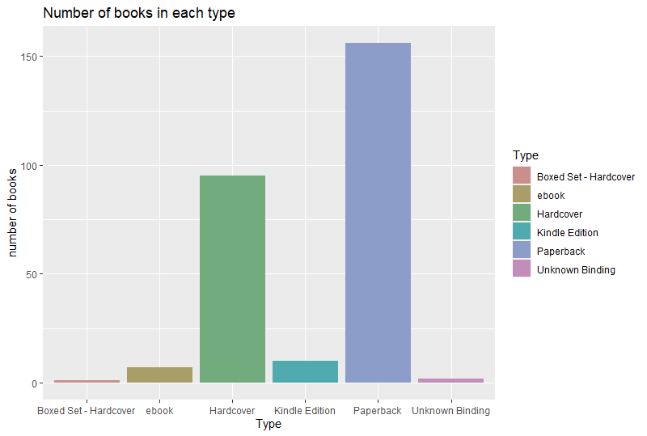
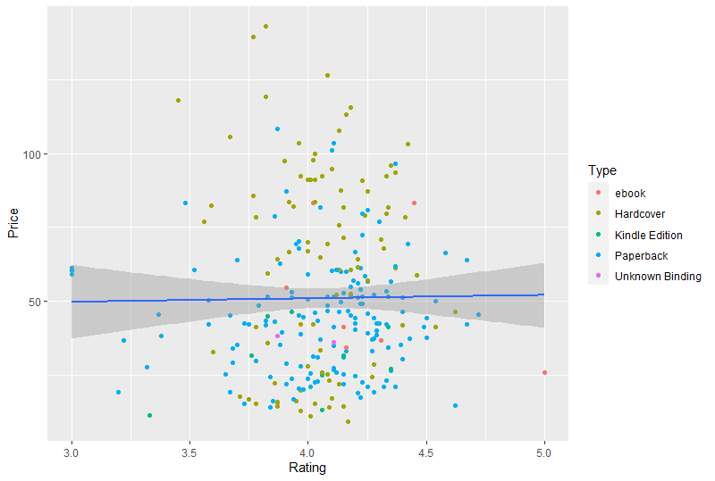

# R-Assignment 4

**Created by Arisa Audomkhachonkitti (ID: 63130500134)**

Choose Dataset:
1. Top 270 Computer Science / Programing Books (Data from Thomas Konstantin, [Kaggle](https://www.kaggle.com/thomaskonstantin/top-270-rated-computer-science-programing-books)) >> [Using CSV](https://raw.githubusercontent.com/safesit23/INT214-Statistics/main/datasets/prog_book.csv)

2. Superstore Sales Dataset (Data from Rohit Sahoo,[Kaggle](https://www.kaggle.com/rohitsahoo/sales-forecasting)) >> [Using CSV](https://raw.githubusercontent.com/safesit23/INT214-Statistics/main/datasets/superstore_sales.csv)


### Outlines
1. Explore the dataset
2. Learning function from Tidyverse
3. Transform data with dplyr and finding insight the data
4. Visualization with GGplot2

## Part 1: Explore the dataset

```
# Library
library(dplyr)
library(ggplot2)

# Dataset
books <- read.csv("prog_book.csv")

# View dataset
glimpse(books)

```

In this dataset has Rating, Reviews, Book_title, Description, Number_Of_Pages, Type, Price

```
Rows: 271
Columns: 7
$ Rating          <dbl> 4.17, 4.01, 3.33, 3.97, 4.06, 3.84, 4.09, 4.15, 3.87, 4.62, 4.03, 3.78, 3.73, 3.87, 3.87, 3.95, 3.85, 3.94, 3.75, 4.10, 4.22,~
$ Reviews         <chr> "3,829", "1,406", "0", "1,658", "1,325", "117", "5,938", "1,817", "2,093", "0", "160", "481", "33", "1,255", "593", "417", "8~
$ Book_title      <chr> "The Elements of Style", "The Information: A History, a Theory, a Flood", "Responsive Web Design Overview For Beginners", "Gh~
$ Description     <chr> "This style manual offers practical advice on improving writing skills. Throughout, the emphasis is on promoting a plain Engl~
$ Number_Of_Pages <int> 105, 527, 50, 393, 305, 288, 256, 368, 259, 128, 352, 352, 200, 328, 240, 288, 392, 304, 336, 542, 192, 242, 224, 412, 318, 4~
$ Type            <chr> "Hardcover", "Hardcover", "Kindle Edition", "Hardcover", "Kindle Edition", "Paperback", "Hardcover", "Hardcover", "Hardcover"~
$ Price           <dbl> 9.323529, 11.000000, 11.267647, 12.873529, 13.164706, 14.188235, 14.232353, 14.364706, 14.502941, 14.641176, 15.229412, 15.22~

```


## Part 2: Learning function from Tidyverse

- Function `select()` from package [dplyr](https://dplyr.tidyverse.org/articles/dplyr.html#select-columns-with-select)). It using for select columns

```
books %>% select(Rating, Book_title, Price)
```
** You can sepearate this part or combine in part of `Transform data with dplyr and finding insight the data`

## Part 3: Transform data with dplyr and finding insight the data

1.Average of rating in each type of book

```
books %>% group_by(Type) %>% select(Type, Rating) %>% summarise(avg = mean(Rating))

```

Result:

```
  Type                    avg
  <chr>                 <dbl>
1 Boxed Set - Hardcover  4.49
2 ebook                  4.29
3 Hardcover              4.06
4 Kindle Edition         4.01
5 Paperback              4.06
6 Unknown Binding        3.99

```

2.Maximum and minimum of rating in each type of book

```
books %>% group_by(Type) %>% select(Type, Rating) %>% summarise(max = max(Rating), min = min(Rating))

```

Result:

```
  Type                    max   min
  <chr>                 <dbl> <dbl>
1 Boxed Set - Hardcover  4.49  4.49
2 ebook                  5     3.91
3 Hardcover              4.77  3.45
4 Kindle Edition         4.35  3.33
5 Paperback              4.72  3   
6 Unknown Binding        4.11  3.87

```

3.Rating that more than 4 have the average price is 4.23

```
books %>% filter(Rating > 4) %>% summarise(avg = mean(Rating))

```

Result:

```
       avg
1 4.233779

```

4.Rating and price of hardcover book that has maximum and minimum reviews

```
hardcover_book <- books %>% filter(Type == 'Hardcover')
max_review <- max(hardcover_book$Reviews)

hardcover_book %>% filter(Reviews == max_review) %>% select(Book_title, Rating, Price)

```

Result:

```
                    Book_title Rating    Price
1 The C++ Programming Language   4.08 69.37941

```

5.Average number of pages in each type of book

```
books %>% group_by(Type) %>% select(Type, Number_Of_Pages) %>% summarise(avg = mean(Number_Of_Pages))

```

Result:

```
  Type                    avg
  <chr>                 <dbl>
1 Boxed Set - Hardcover  896 
2 ebook                  386 
3 Hardcover              614.
4 Kindle Edition         283.
5 Paperback              407.
6 Unknown Binding        249 

```

6.Average of price that book has the number of pages between 300 and 400

```
books %>% filter(Number_Of_Pages > 300, Number_Of_Pages < 400) %>% summarise(avd_price = mean(Price))

```

Result:

```
  avd_price
1  40.64745

```
## Part 4: Visualization with GGplot2
### 1.) Graph show the number of books in each type
```
# Step 1: Creating a basic Bar Graph
# Save to object
books_bar<- ggplot(books,aes(x=Type)) + geom_bar()
books_bar

# Adding component
books_bar + ggtitle("Number of books in each type") +
  xlab("Type") + ylab("number of books")
  
```
Result:



### 1.) Graph show relation between rating and price
```
# Step 1: Creating a scatter plot
books %>% ggplot(aes(x=Rating,y=Price))+geom_point()

# Step 2: Using filter data to expand more details
books %>% filter(Price<150) %>% ggplot(aes(x=Rating,y=Price))+geom_point()

# Step 3: Label type with color
books_scatter <- books %>% filter(Price<150) %>% ggplot(aes(x=Rating,y=Price))+geom_point()+
  geom_point(aes(color=Type))

books_scatter

# Step 4: Adding a line of best fit to a plot
books_scatter + geom_smooth() 
books_scatter + geom_smooth(method="lm") #linear model
  
```
Result:



**Guideline:
Embed Image by using this syntax in markdown file
````

````
