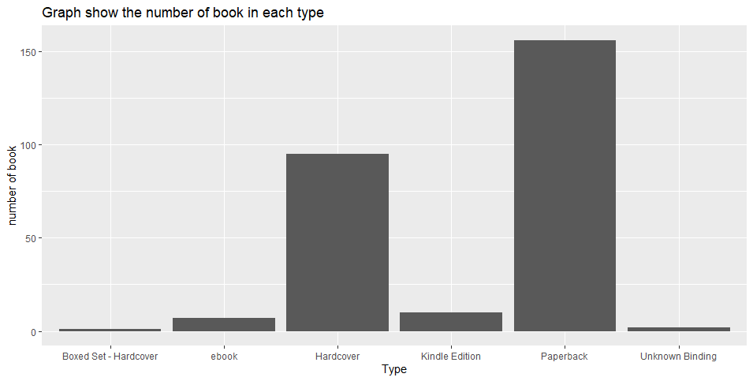

# R-Assignment 4

**Created by Name-Surname (ID: 63130500140)**

Choose Dataset:
1. Top 270 Computer Science / Programing Books (Data from Thomas Konstantin, [Kaggle](https://www.kaggle.com/thomaskonstantin/top-270-rated-computer-science-programing-books)) >> [Using CSV](https://raw.githubusercontent.com/safesit23/INT214-Statistics/main/datasets/prog_book.csv)

2. Superstore Sales Dataset (Data from Rohit Sahoo,[Kaggle](https://www.kaggle.com/rohitsahoo/sales-forecasting)) >> [Using CSV](https://raw.githubusercontent.com/safesit23/INT214-Statistics/main/datasets/superstore_sales.csv)


### Outlines
1. Explore the dataset
2. Learning function from Tidyverse
3. Transform data with dplyr and finding insight the data
4. Visualization with GGplot2

## Part 1: Explore the dataset

```
# Library
library(dplyr)

# Dataset
books <- read.csv("prog_book.csv")

# View Dataset
glimpse(books)

```
In this dataset has Rating, Reviews, Book_title, Description, Number_Of_Pages, Type, Price    
```
Rows: 271
Columns: 7
$ Rating          <dbl> 4.17, 4.01, 3.33, 3.97, 4.06, 3.84, 4.09, 4.15, 3.87, 4.62, 4.03, 3.78, 3.73, 3.87, 3.87, 3.95, 3.85, 3.94, 3.75, 4.10, 4.2~
$ Reviews         <chr> "3,829", "1,406", "0", "1,658", "1,325", "117", "5,938", "1,817", "2,093", "0", "160", "481", "33", "1,255", "593", "417", ~
$ Book_title      <chr> "The Elements of Style", "The Information: A History, a Theory, a Flood", "Responsive Web Design Overview For Beginners", "~
$ Description     <chr> "This style manual offers practical advice on improving writing skills. Throughout, the emphasis is on promoting a plain En~
$ Number_Of_Pages <int> 105, 527, 50, 393, 305, 288, 256, 368, 259, 128, 352, 352, 200, 328, 240, 288, 392, 304, 336, 542, 192, 242, 224, 412, 318,~
$ Type            <chr> "Hardcover", "Hardcover", "Kindle Edition", "Hardcover", "Kindle Edition", "Paperback", "Hardcover", "Hardcover", "Hardcove~
$ Price           <dbl> 9.323529, 11.000000, 11.267647, 12.873529, 13.164706, 14.188235, 14.232353, 14.364706, 14.502941, 14.641176, 15.229412, 15.~

```

## Part 2: Learning function from Tidyverse

- Function `select()` from package [dplyr](https://dplyr.tidyverse.org/articles/dplyr.html#select-columns-with-select)). It using for select columns

```
books %>% select(Book_title, Type)
```
** You can sepearate this part or combine in part of `Transform data with dplyr and finding insight the data`

## Part 3: Transform data with dplyr and finding insight the data

1.ลิสประเภทหนังสือทั้งหมดเเล้วนับดูว่าเเต่ละประเภทมีหนังสือกี่เล่ม

```
books %>% group_by(Type) %>% count()

```
Result:
```
 Type                      n
  <chr>                 <int>
1 Boxed Set - Hardcover     1
2 ebook                     7
3 Hardcover                95
4 Kindle Edition           10
5 Paperback               156
6 Unknown Binding           2

```
//Explain
จัดกลุ่มประเภทของหนังสือโดยใช้คําสั่ง group by เเละนับจํานวนหนังสือเเต่ละประเภทโดยใช้คําสั่ง count


2.ลิสรายชื่อหนังสือที่ไม่เคยได้รับการรีวิวเลย พร้อมทั้งบอกราคาของหนังสือเล่มนั้น

```
books %>% select(Book_title,Reviews,Price) %>% filter(Reviews==0)

```
Result:
```
                                                                                                                                Book_title Reviews     Price
1                                                                                               Responsive Web Design Overview For Beginners       0  11.26765
2                                                                            ZX Spectrum Games Code Club: Twenty fun games to code and learn       0  14.64118
3                                                                                                              Game Programming Golden Rules       0  19.15294
4                                                          Beginners Guide On PHP Programming: Quick And Easy Guide To Learn PHP With My-SQL       0  23.22647
5                                     Python Programming Books Set: Python Programming for Beginners & Complete Guide for Python Programming       0  23.85882
6                                                                                                                    Your First App: Node.js       0  25.85588
7                                                              Python Programming For Beginners: Quick And Easy Guide For Python Programmers       0  29.02059
8                                                                                                            Building an FPS Game with Unity       0  50.72647
9                                                                                        Advanced Game Programming: A Gamedev.Net Collection       0  59.08235
10                                                                                                                        Basic Proof Theory       0  59.52647
11                                                 Cross-Platform Game Programming (Game Development) (Charles River Media Game Development)       0  60.39118
12                                                                                   Lambda-Calculus, Combinators and Functional Programming       0  61.16765
13                                                        The Calculus of Computation: Decision Procedures with Applications to Verification       0  66.82059
14                                                                        Communication Networks: Fundamental Concepts and Key Architectures       0  75.70000
15                                                                          Genetic Programming II: Automatic Discovery of Reusable Programs       0  82.36765
16                                                                                                                   Game Programming Gems 2       0  91.04706
17                                                                                                                   Game Programming Gems 5       0  91.04706
18                                     A First Course in Logic: An Introduction to Model Theory, Proof Theory, Computability, and Complexity       0  96.49412
19                                                                                                                   Game Programming Gems 6       0 119.20294
20                                                                                                                   Game Programming Gems 4       0 139.43529
21                                                                                                                   Game Programming Gems 3       0 143.13824
22 3D Game Engine Architecture: Engineering Real-Time Applications with Wild Magic (The Morgan Kaufmann Series in Interactive 3d Technology)       0 203.10882

```
//Explain
เลือกข้อมูที่ต้องการให้เเสดง เเละ filter reviews ที่มีค่าเท่ากับ 0


 3.ลิสหาชื่อหนังสือที่ rating>3.5 ขึ้นไป เเละได้รับการรีวิวมากกว่า 1000 รีวิว

```
books %>% group_by(Type) %>% count()

```
Result:
```
 Type                      n
  <chr>                 <int>
1 Boxed Set - Hardcover     1
2 ebook                     7
3 Hardcover                95
4 Kindle Edition           10
5 Paperback               156
6 Unknown Binding           2

```
//Explain
จัดกลุ่มประเภทของหนังสือโดยใช้คําสั่ง group by เเละนับจํานวนหนังสือเเต่ละประเภทโดยใช้คําสั่ง count


4.ลิสประเภทหนังสือทั้งหมดเเล้วนับดูว่าเเต่ละประเภทมีหนังสือกี่เล่ม

```
books %>% group_by(Type) %>% count()

```
Result:
```
 Type                      n
  <chr>                 <int>
1 Boxed Set - Hardcover     1
2 ebook                     7
3 Hardcover                95
4 Kindle Edition           10
5 Paperback               156
6 Unknown Binding           2

```
//Explain
จัดกลุ่มประเภทของหนังสือโดยใช้คําสั่ง group by เเละนับจํานวนหนังสือเเต่ละประเภทโดยใช้คําสั่ง count


5.ลิสประเภทหนังสือทั้งหมดเเล้วนับดูว่าเเต่ละประเภทมีหนังสือกี่เล่ม

```
books %>% group_by(Type) %>% count()

```
Result:
```
 Type                      n
  <chr>                 <int>
1 Boxed Set - Hardcover     1
2 ebook                     7
3 Hardcover                95
4 Kindle Edition           10
5 Paperback               156
6 Unknown Binding           2

```
//Explain
จัดกลุ่มประเภทของหนังสือโดยใช้คําสั่ง group by เเละนับจํานวนหนังสือเเต่ละประเภทโดยใช้คําสั่ง count


6.ลิสประเภทหนังสือทั้งหมดเเล้วนับดูว่าเเต่ละประเภทมีหนังสือกี่เล่ม

```
books %>% group_by(Type) %>% count()

```
Result:
```
 Type                      n
  <chr>                 <int>
1 Boxed Set - Hardcover     1
2 ebook                     7
3 Hardcover                95
4 Kindle Edition           10
5 Paperback               156
6 Unknown Binding           2

```
//Explain
จัดกลุ่มประเภทของหนังสือโดยใช้คําสั่ง group by เเละนับจํานวนหนังสือเเต่ละประเภทโดยใช้คําสั่ง count


## Part 4: Visualization with GGplot2
### 1.) Graph show relation between height and mass
```
scat_plot <- starwars %>% filter(mass<500) %>% ggplot(aes(x=height,y=mass))+
  geom_point(aes(color=gender))

scat_plot+geom_smooth()
```
Result:



**Guideline:
Embed Image by using this syntax in markdown file
````

````
